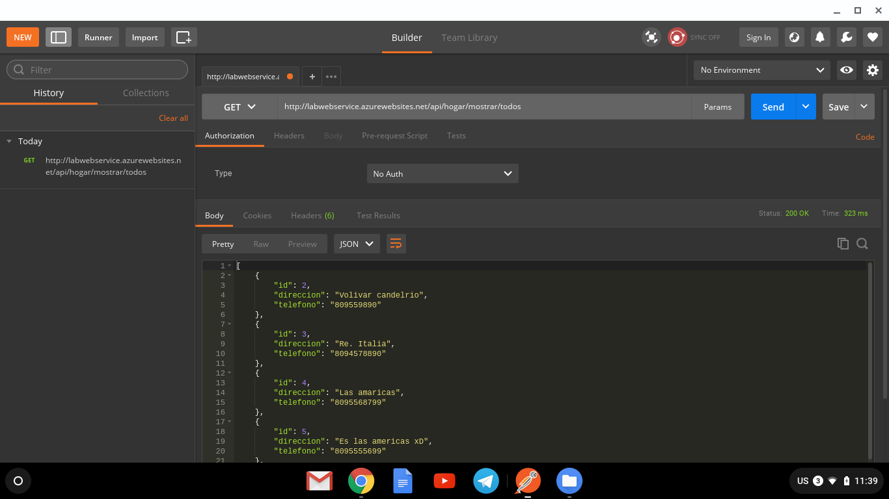
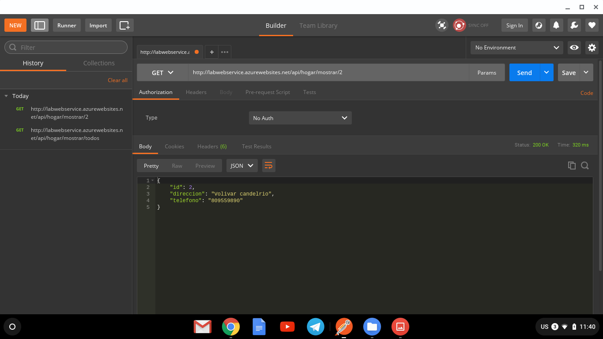
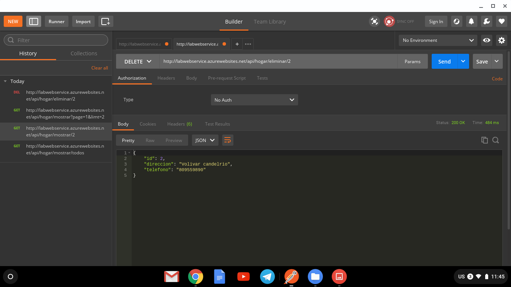
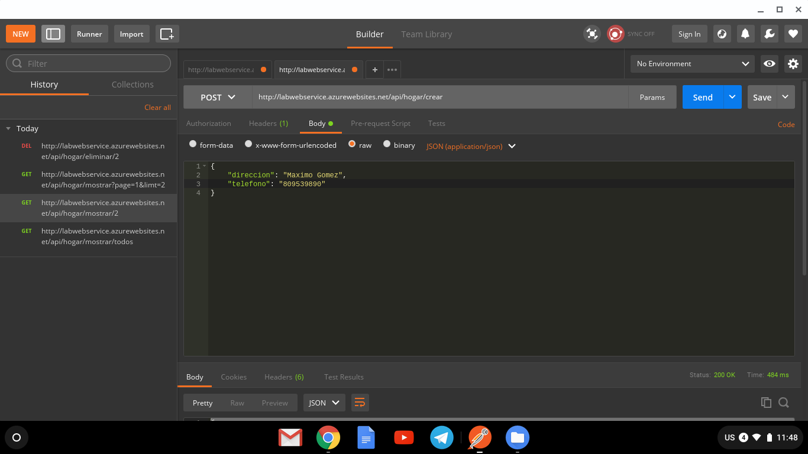
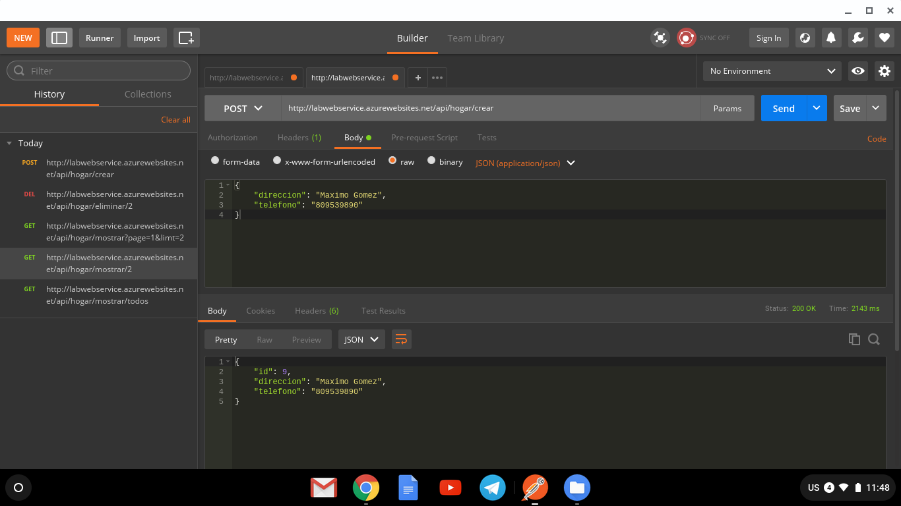
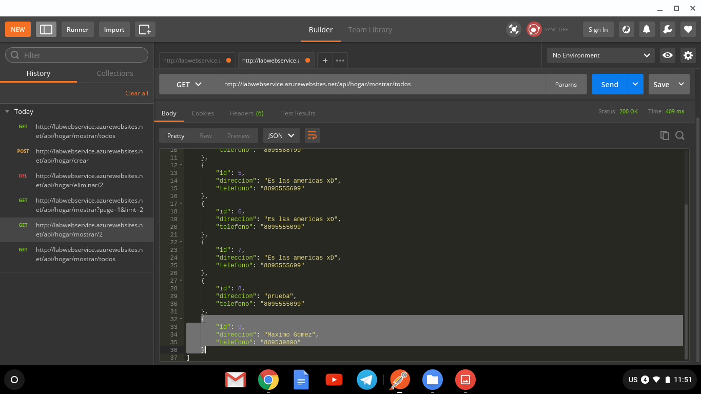
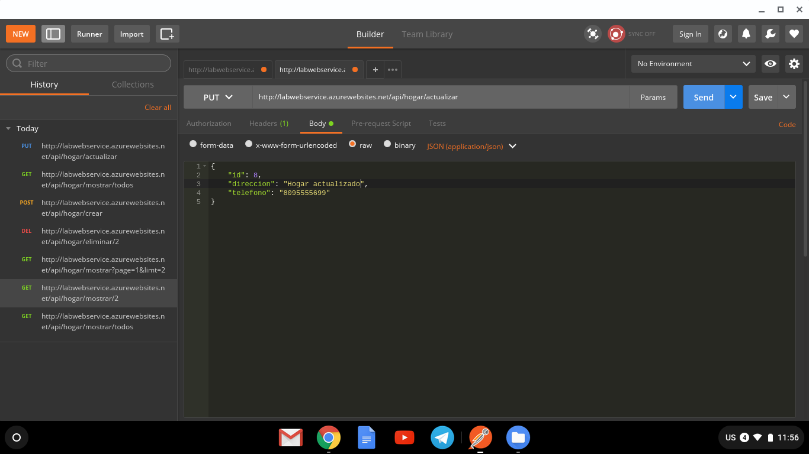
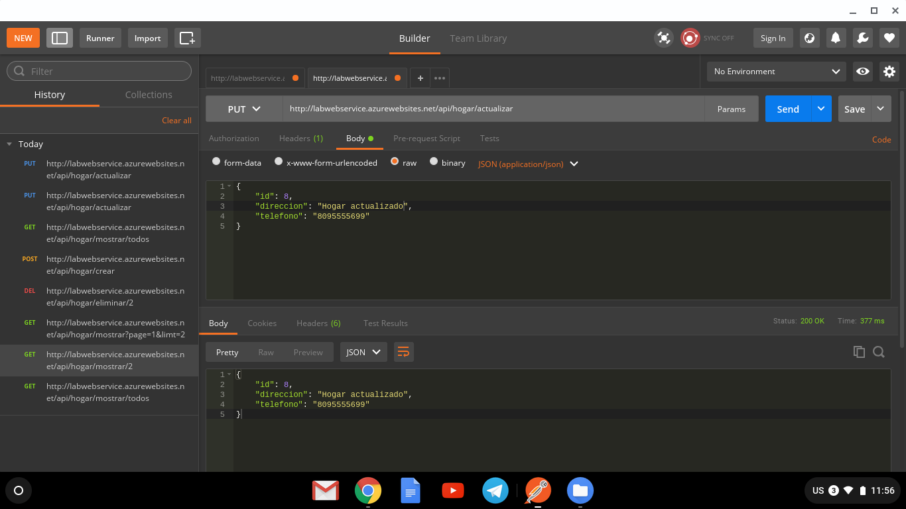
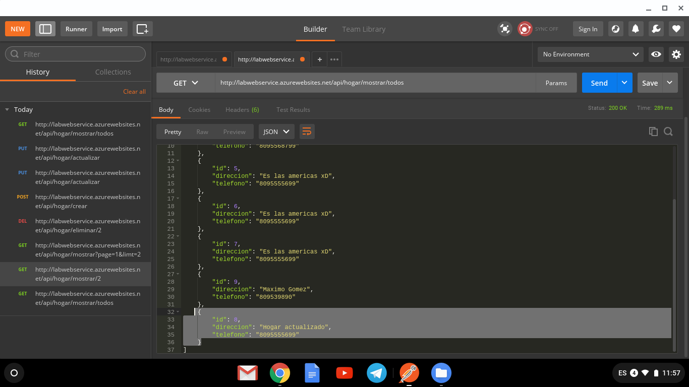

<h1 style="font-family: Arial; text-align: center">Hogar API</h1>
<h2>Descripcion</h2>  
     
 

Hogar Api tiene como objetivo registrar, mostrar y eliminar y editar viviendas, esta es un API Rest desarrollada con Spring boot, la misma transacciona con una base de datos PostgreSQL alojada remotamente, también la API se encuentra alojado en Azure en un Docker container.

Url: http://labwebservice.azurewebsites.net/api/hogar/mostrar/todos

<h2>Tecnologias usadas<h2>
  <h3 style="display: inline; font-family: Arial">Lenguaje de programacion:</h3>
 
  

  <ul> 
    <li>Java</li>
  </ul>
  

 

 
 <h3 style="display: inline; font-family: Arial">Framework:</h3>
  
  
 
    <ul>
      <li>Spring (Spring Boot)</li>
    </ul>
  

  
   <h3 style="display: inline; font-family: Arial">Lenguajes de intercambio de datos:</h3>
  
  
 
    <ul>
      <li>JSON</li>
    </ul>
  

  
 <h3 style="display: inline; font-family: Arial">Herramienta para gestión y construcción de software:</h3>
  
  
 
    <ul>
      <li>Maven</li>
    </ul>
  

  
   <h3 style="display: inline; font-family: Arial">Servidor:</h3>
  
  
 
    <ul>
      <li>Apache Tomcat</li>
    </ul>
  

  
  <h3 style="display: inline; font-family: Arial">Base de Datos:</h3>
  
  
 
    <ul>
      <li>PostgreSQL</li>
    </ul>
  

  
  <h3 style="display: inline; font-family: Arial">IDE:</h3>
  
  
 
    <ul>
      <li>Spring tool suite</li>
    </ul>
  

  
  
  
  <h1>Screenshots</h1>

<h3 style="display: inline; font-family: Arial">Mostrando todos los hogares</h3>
 

 

<h3 style="display: inline; font-family: Arial">Mostrando hogar por su id</h3>
 

 

<h3 style="display: inline; font-family: Arial">Eliminado hogar por su id</h3>
 

 

<h3 style="display: inline; font-family: Arial">Creando un nuevo hogar</h3>
 

 

<h3 style="display: inline; font-family: Arial">Mostrando nuevamente la lista de hogares</h3>

Como se puede ver ahora se encuentra el hogar creado anteriormente

 

 

<h3 style="display: inline; font-family: Arial">Actualizando hogar</h3>
 

 

<h3 style="display: inline; font-family: Arial">Actualizando hogar</h3>
 

 

<h3 style="display: inline; font-family: Arial">Mostrando nuevamente la lista de hogares</h3>

Como se puede ver ahora se actualizo el hogar

 

 

  
  
  
  
  
  
  
  
  
  
  
  
